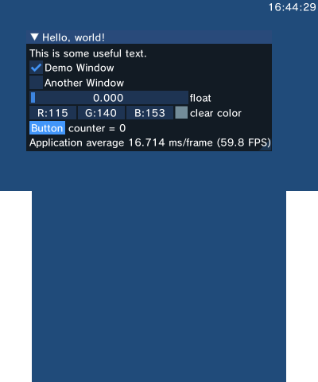

# A small demo of dear imgui on a 3DS

Made possible by the citro3d port, which is part of ftpd:
https://github.com/mtheall/ftpd

## Screenshot



## License

MIT, see [LICENSE](LICENSE).

## Building

```shell
cmake -B build-3ds . -DCMAKE_TOOLCHAIN_FILE=/opt/devkitpro/cmake/3DS.cmake \
  -DCMAKE_CXX_COMPILER_LAUNCHER=ccache -DCMAKE_BUILD_TYPE=Debug -G Ninja
cmake --build build-3ds
citra build-3ds/ex.3dsx
3dslink build-3ds/ex.3dsx

```
